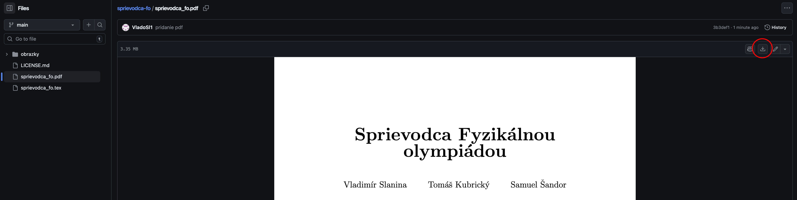

# Sprievodca Fyzikálnou olympiádou

Najnovšiu verziu nájdete [tu](sprievodca_fo.pdf). Na stiahnutie stlačte tlačidlo vyznačené na obrázku nižšie.

---

**Sprievodca fyzikálnou olympiádou** je dokument, ktorý sme vytvorili za účelom zjednodušenia prípravy na Fyzikálnu olympiádu. Obsahuje praktické odporúčania týkajúce sa jej riešenia, odporúčané materiály a sylabus. Je rozdelený do niekoľkých úrovní, preto veríme, že si v ňom každý riešiteľ nájde niečo, čo mu pomôže sa posunúť ďalej. 

Dokument obsahuje veľmi veľa odkazov, ktoré sú zvýraznené v obdĺžnikoch. Odporúčame preto, aby ste si skontrolovali, či vám ich zobrazuje správne (napr. internetové prehliadače ich nezvyknú zobrazovať, naopak Adobe Acrobat funguje).

## Ako viete pomôcť vylepšiť tohto Sprievodcu?

Veľmi uvítame ľubovoľnú iniciatívu zlepšiť alebo aktualizovať tohto Sprievodcu Fyzikálnou olympiádou. Je napísaný v LaTeXu v prostredí [Overleaf](https://www.overleaf.com/) a sprístupnený cez GitHub, teda sa ponúka niekoľko možností ako pomôcť:

- v Overleafe (po kontaktovaní autorov získate prístup)
- forknúť toto repo, urobiť zmeny v samostatnom branchi a urobiť pull request s popisom zmien (viac na tomto [tutorialy](https://docs.github.com/en/get-started/exploring-projects-on-github/contributing-to-a-project)
- napísať zmeny do emailu, anotovanom PDF alebo ľubovoľným iným spôsobom

Uvítame pomoc v ľubovoľnom rozsahu, či už ide o odporučenie nejakéhho dobrého učebného materiálu, opravenie gramatických/logických chýb, napísanie svojho názoru na toto dielo...

#### V prípade záujmu nám určite napíšte na vladimir.slanina.jr@gmail.com
